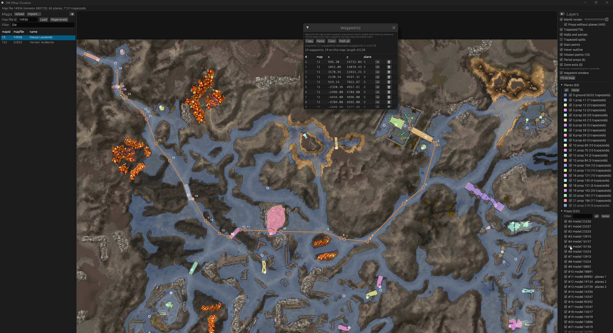
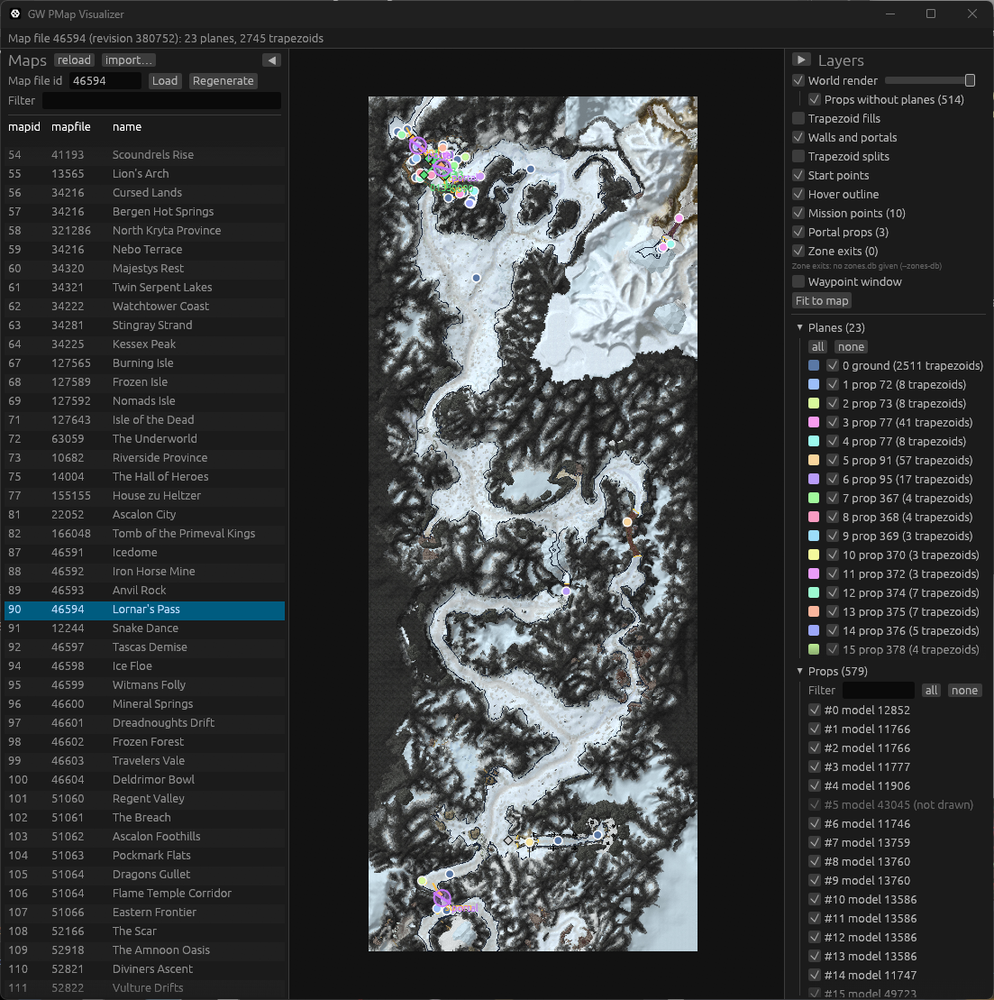

# Guild Wars Navigator

> **Transparency statement:** This program was built by **Claude**, an AI model made by Anthropic, working in Claude Code. The project's maintainer set the requirements, directed the work, reviewed the results and tested them in the game. Claude wrote the code, the reverse-engineering notes in `docs/` and this README. Most commits carry a `Co-Authored-By: Claude` trailer.

Guild Wars Navigator (`gw-nav`) is a Rust toolkit and visualizer for Guild Wars pathing maps. It downloads map files on demand from the Guild Wars fileserver and generates the client's navigation mesh from them, byte for byte as the game does. It shows that mesh over a top-down render of the map, and adds tools for waypointing and pathfinding. It runs as a desktop app and in the browser.

This is an unofficial fan project. It isn't affiliated with or endorsed by ArenaNet or NCSOFT. Guild Wars is their trademark.



*Diessa Lowlands: the ground plane and prop planes over the world render, with a 29-waypoint path in the Waypoints window.*



*Lornar's Pass: the map list on the left, and the Layers panel with per-plane and per-prop toggles on the right.*

## What it does

- **On-demand map data.** It fetches map files, models and textures from the Guild Wars fileserver through its asset manifest, and caches them locally. It never reads a local `Gw.dat`.
- **Bit-exact pathing generation.** The fileserver serves map files in their raw form. The game client "bloats" them and generates the pathing data itself. This project ports that pipeline:
  - terrain height decoding
  - the slope tracer
  - prop collision
  - plane assembly
  - the trapezoidal map builder

  The resulting path chunk matches the client's own byte for byte, so plane and trapezoid ids agree with what the game and bots see. The only gap is zone obstacles (path tag 13), which are not ported yet.
- **Top-down world render.** When a map's pathing is generated, the map is also rendered top-down on the CPU and cached as an image:
  - terrain, with the client's texture splatting and hill-shading
  - water
  - textured prop models, each baked separately so it can be hidden
- **Visualizer.** A map list from the MapDb, with on-demand loading. The map is drawn in wgpu with these layers:
  - the world render
  - trapezoid fills, walls and portals
  - start points, mission points, portal props and recorded zone exits
  - per-plane and per-prop visibility
- **Waypointer.** Right-click to add a waypoint, drag one to move it, and Delete removes the waypoint under the cursor. Waypoint lists can span maps, and the visualizer finds shortest paths between waypoints. Lists copy and paste as text that drops into a Lua table:

  ```text
  { x = -1234.50000, y = 678.25000, plane = 0, mapid = 7 },
  ```
- **Relay server.** Browsers can't reach the fileserver, so the `gw-nav-relay` binary serves the web build and its data over HTTP, generating it on demand like the desktop app does.

## Getting started

You need a stable Rust toolchain (edition 2024).

### Desktop visualizer

```sh
cargo run --release                             # opens with the map list
cargo run --release -- 290943                   # loads a map file on startup
```

Options:
- `--db mapfiles.db`: the MapDb SQLite file.
- `--cache-dir cache`: downloads and generated data.
- `--zones-db <gwbs zones.db>`: recorded zone exits.
- `--relay <url>`: get data from a relay instead of the fileserver.

The first load of a map downloads it and its models and textures, then generates the pathing and the render. Later loads come from the cache.

### Web visualizer

See [`web/README.md`](web/README.md). In short:

```sh
rustup target add wasm32-unknown-unknown
cargo install wasm-bindgen-cli --version 0.2.129 --locked   # must match Cargo.lock
web/build.sh                                                 # or web/build.ps1
cargo run --release --bin gw-nav-relay
```

Then open <http://127.0.0.1:8080/?map=290943>.

The relay needs no GPU. On a server, build it with `cargo build --release --bin gw-nav-relay --no-default-features`.

### Command line

The `gw-nav-cli` binary covers the MapDb and the data pipeline, and builds without the GUI stack (`--no-default-features`). Run `cargo run --release --bin gw-nav-cli -- --help` for details.

| Command | What it does |
|---|---|
| `list`, `search <query>`, `get <mapid>`, `set …` | Read and edit the MapDb (`map_zones`: mapid, name, mapfile) |
| `import <other.db>` | Merge map rows from another MapDb |
| `download <ids…> --out-dir <dir>` | Download files from the fileserver, decompressed |
| `manifest` | Print the file ids the fileserver announces |
| `chunks <file>` | List the chunks of an FFNA file |
| `fetch-models <mapfile_id>` | Download a map's prop models |
| `pathing <mapfile_id> [--refresh] [--out <file>]` | Load or generate a map's pathing data |
| `render <mapfile_id> [--refresh] [--out x.jpg]` | Load or bake a map's top-down render |
| `render <mapfile_id> --scale <units/px> --out x.png` | Render a preview at another resolution, uncached |
| `scan-manifest [--verify]` | Record the asset manifest's map files that no map row names; `--verify` downloads them to check |
| `image-all [--jobs N] [--connections N] [--limit N] [--dry-run]` | Like the game client's `-image`: download, bloat and render every known map file whose current revision isn't cached, N maps at a time over a shared fileserver connection pool |
| `scan-zones [--cached-only]` | Record every map file's zone def `.ini` paths, for the visualizer's Maps list |
| `zone-chunk <file> [--no-vertices]` | Dump a map file's Zones chunk in readable form |

## Data and caching

- **MapDb.** `mapfiles.db` drives the map list. It has two tables:
  - `map_zones`: map ids, names and map file ids, the same schema as GWBS `maploadlog.lua`. Imports merge only this table.
  - `manifest_mapfiles`: map files found in the fileserver's asset manifest. Whenever the CLI, desktop app or relay loads a new manifest, they record its map files here. The ones no `map_zones` row names appear at the end of the map list without a map id; a map's id is only learned when GWBS logs it being loaded.
- **Cache** (`cache/`, shared by the CLI, the desktop app and the relay):
  - `manifest-<id>.bin`: the asset manifest.
  - `files/<file_id>.bin`: decompressed downloads.
  - `pathing/<mapfile>-r<file>-v<N>.path`: generated stage-2 path chunks.
  - `render/<mapfile>-r<file>-v<N>.gwri`: baked renders (the terrain image and a sprite per prop).

  Entries are keyed by map file revision and format version. A game update, or a change to the generator or renderer, regenerates only what changed.

## Relay API

From `src/api.rs`:

| Endpoint | Returns |
|---|---|
| `GET /api/maps` | The map list as JSON: MapDb rows, then the manifest's map files with a `null` mapid |
| `GET /api/pathing/<mapfile_id>[?refresh=1]` | The stage-2 path chunk; its revision is in `X-Gw-File-Id` |
| `GET /api/annotations/<mapfile_id>` | Mission points, portal props and recorded zone exits as JSON |
| `GET /api/render/<mapfile_id>[?refresh=1]` | The baked top-down render (`render::WorldRender`) |

## Project layout

| Path | Contents |
|---|---|
| `src/fileconn/` | Fileserver protocol, decompression, asset manifest |
| `src/mapfile/` | FFNA map file chunks: terrain, props, path, mission, environment, map parameters |
| `src/pathgen/` | The client's pathing bloat, ported bit-exact (tracer, props collision, assembly, clipping, trapezoid builder) |
| `src/pathing/` | `PathingStore`: on-demand download, generation and caching |
| `src/render/` | The CPU top-down renderer: texture decoding, terrain, models, props, image format |
| `src/pathfind.rs`, `src/waypoint.rs` | Pathfinding over the navmesh; the waypoint list format |
| `src/mapdb.rs`, `src/zones.rs` | MapDb access; map annotations and recorded zone exits |
| `src/bin/visualizer/` | The egui/wgpu visualizer (desktop and web), the default binary |
| `src/bin/gw-nav-cli.rs` | The command line tool |
| `src/bin/gw-nav-relay.rs` | The HTTP relay for the web build |
| `examples/` | Dev tools: extract reference files from a `Gw.dat`; dump textures to PNG |
| `docs/` | Reverse-engineering notes and specs (below) |

## Documentation

- [`docs/REQUIREMENTS.md`](docs/REQUIREMENTS.md): the project's goals.
- [`docs/mapblob-format.md`](docs/mapblob-format.md): the map file format, stage 1 (as served) and stage 2 (as bloated by the client), chunk by chunk.
- [`docs/pathing-format-findings.md`](docs/pathing-format-findings.md): how the pathing data turned out to be generated by the client, and the porting roadmap.
- [`docs/world-render-scope.md`](docs/world-render-scope.md): the top-down render, from its scope to the implementation notes.

## Tests

```sh
cargo test --release
```

The bit-exact tests compare against reference files in `testdata/`. These are game data, so they're gitignored. Tests whose files are missing are skipped. To create them for a map file id:

```sh
cargo run --release --bin gw-nav-cli -- download <id> --out-dir testdata   # stage 1, from the fileserver
cargo run --release --example dat_extract -- <Gw.dat> <id> testdata/<id>.stage2.bin   # the client's stage 2
cargo run --release --bin gw-nav-cli -- fetch-models <id> --out-dir testdata/models
```

A `Gw.dat` is used only to produce these test oracles. The program never reads one.

## Acknowledgements

- **Huge thanks to [Jonathan Bjørn Greve](https://github.com/Jonathan-Greve) and [GuildWarsMapBrowser](https://github.com/Jonathan-Greve/GuildWarsMapBrowser).** Much of the world render (`src/render/`) comes from GWMB. The ATEX/ATTX texture decoder is ported from its `AtexReader.cpp`/`AtexDecompress.cpp`/`AtexAsm.cpp`. Terrain splatting follows its `Terrain.cpp` and terrain shaders. The environment (lighting/water) chunk layout and the model format work start from its readers, and the top-down bake is modelled on its orthographic export. Its ImHex patterns and `FFNA_MapFile.h` were also key to understanding the stage-2 map and pathing chunks. Without GWMB's years of reverse-engineering, this project would have been far harder. The ported code is used under its license; see [THIRD_PARTY_NOTICES.md](THIRD_PARTY_NOTICES.md).
- GWCA and GWBS are the references for in-memory structures and in-game ground truth.
